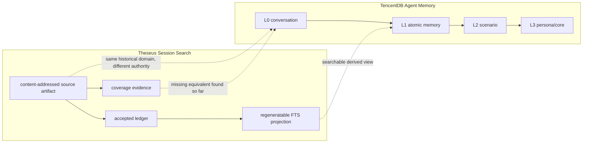

# TencentDB Agent Memory vs Session Search: source map and evidence boundary

Status: research checkpoint for #8, not an integration decision.

## Pinned sources

TencentDB Agent Memory:

```text
repo: TencentCloud/TencentDB-Agent-Memory
revision: 8f2dc830317934e54548472bf62c5999f9bb1202
observed default branch: feat/server_team
```

Theseus Session Search Lab:

```text
repo: TeaShaman-cyber/theseus-session-search-lab
revision inspected: 243273e012f163fb7c2c0a550dba852908074ed9
branch observed: docs/upstream-memory-proposals
```

The comparison is source-based. README claims are used only when the pinned implementation agrees with them.

## Result in one sentence

**INFERENCE:** TencentDB L0 and Theseus Session Search overlap as historical-input surfaces, but they have different authority contracts: Session Search is an independently verifiable historical-evidence archive with explicit coverage, while TencentDB L0 is an operational conversation store feeding a mutable memory pipeline.

This suggests complementarity rather than replacement:

```text
Session Search
  = independent historical witness

TencentDB Agent Memory
  = operational capture -> derived memory -> recall/control plane
```

## Source map

### Session Search

```text
capture/export source
  -> immutable/content-addressed artifact
  -> accepted-artifact ledger
  -> importer/normalizer
  -> regeneratable SQLite/FTS projection
  -> bounded historical evidence returned to assistant
```

Relevant source contracts:

- `README.md`: session history is evidence, not semantic memory; the SQLite FTS index is a projection, not authority.
- `docs/architecture.md`: immutable/content-addressable artifacts are upstream of the searchable projection.
- `session_search/artifact.py`: artifacts and canonical messages carry SHA-256 identities; message occurrences keep source-object hashes.
- `session_search/corpus_store.py`: artifact blobs are stored by SHA-256; accepted-ledger membership is explicit; projection membership and ledger digests are verified; projection can be rebuilt from accepted artifacts.
- coverage is explicit: `COMPLETE_EXPOSED_CONVERSATION` vs `PARTIAL_SESSION_SLICE`.

### TencentDB Agent Memory

```text
Hermes provider or Memory Proxy
  -> L0 conversation store
  -> async L1 extraction
  -> L2 scenario aggregation
  -> L3 persona/core
  -> recall/injection + Memory Hub asset management
```

Relevant pinned implementation:

- `MemoryCore/src/gateway/v2-router.ts`
  - `conversation/add` creates L0 message records and persists them before notifying the async pipeline;
  - the source comments call L0 an `不可变流水` (immutable flow) for mutation-audit purposes;
  - L0 nevertheless has explicit delete and expiry paths.
- `MemoryCore/src/core/store/types.ts`
  - L0 records carry team/user/agent/task/session identity plus role, text, recorded time, and original timestamp.
- `MemoryCore/hermes-plugin/memory/memory_tencentdb/__init__.py`
  - `prefetch()` synchronously reads L1 + L2 + L3;
  - `sync_turn()` asynchronously writes the user/assistant turn to L0;
  - `system_prompt_block()` returns an empty string while the gateway is unavailable;
  - `on_memory_write()` is currently a no-op;
  - `on_session_end()` is currently a no-op because v3 relies on timer-based pipeline handling.

## Similarity graph



The dashed edges are analogies, not identity claims.

## Where the overlap is real

### 1. Raw conversation is preserved below higher-level retrieval

**FACT:** TencentDB keeps L0 conversation messages below L1/L2/L3. Session Search keeps source conversation artifacts below its searchable projection.

This is structurally similar:

```text
historical source
  -> derived searchable/working view
```

The important common idea is that a search/index layer need not be the only retained representation.

### 2. Derived indexes can be rebuilt or reprocessed

**FACT:** Session Search deliberately treats SQLite/FTS as rebuildable from accepted artifacts.

**FACT:** TencentDB separates L0 capture from asynchronous L1/L2/L3 processing and contains pipeline/reindex/re-extraction machinery.

**INFERENCE:** Both systems benefit from separating source capture from derived retrieval structures, although TencentDB derives semantic memory while Session Search intentionally does not.

### 3. Both need stable session/message identity

Session Search records stable semantic session identity, canonical message hashes, and source-object hashes. TencentDB carries explicit team/user/agent/task/session dimensions through L0/L1 APIs.

The problem domain overlaps, but the emphasis differs:

```text
Session Search -> evidence identity + capture provenance
TencentDB      -> operational isolation + routing identity
```

## Where the systems are materially different

### A. L0 is not equivalent to a Session Search source artifact

Tencent source comments describe L0 as an immutable flow for update/audit semantics, but the pinned implementation exposes:

```text
conversation/delete
deleteL0(...)
deleteL0BySession(...)
deleteL0Expired(...)
```

Therefore:

**FACT:** Tencent L0 messages are not an independently immutable archive in the Session Search sense. They can be removed by supported operational paths and retention cleanup.

By contrast, Session Search accepted artifacts are content-addressed blobs whose bytes/hash are verified and whose projection is disposable.

**INFERENCE:** Tencent L0 is better described as an operational historical store than as a canonical forensic witness.

### B. Session Search has explicit coverage semantics; TencentDB L0 currently does not

Session Search tracks whether an imported artifact reaches the exposed historical boundary:

```text
COMPLETE_EXPOSED_CONVERSATION
PARTIAL_SESSION_SLICE
```

and carries the invariant:

```text
search miss + incomplete/unknown coverage -> UNKNOWN, not absence
```

No equivalent capture-completeness boundary was found in the pinned Tencent L0 data-plane model. Tencent has pipeline completeness, partial recall and task-completion concepts, but those are different from proving what fraction of historical conversation was ever captured.

**INFERENCE:** A zero-result Tencent L0/L1 search should not be treated as proof that an event never occurred unless capture completeness is established independently.

### C. Session Search provenance is stronger at the evidence boundary

Session Search retains:

```text
artifact_sha256
canonical_message_sha256
source_object_sha256
accepted-ledger digest
coverage state
```

Tencent L1 extraction defines `source_message_ids`, and the writer carries them into `MemoryRecord`.

However, at the pinned revision:

```text
MemoryCore/src/core/record/l1-reader.ts
  source_message_ids: [] // not stored in SQLite
```

and the dedup conversion similarly reconstructs L1 records with an empty source-message list.

**FACT:** the source linkage exists in the extraction object model but is not preserved through the SQLite read path at this revision.

This matches upstream issue #1025 and directly intersects Theseus #2/#3 provenance and reconciliation questions.

### D. Tencent memory can change agent behavior directly

Session Search results are historical evidence supplied to the assistant and explicitly must not become current operational authority.

Tencent L1/L2/L3 is designed for automatic recall/injection, persona restoration, skill/asset loadout, and team routing.

**FACT:** Tencent is closer to an operational memory/control plane. Session Search is intentionally an evidence retrieval subsystem.

This difference should be preserved even if the systems are bridged.

## Hermes-specific boundary

Pinned Tencent Hermes provider:

```text
prefetch(query)
  -> L1 atomic/search
  -> L2 scenario/list
  -> L3 core/read

sync_turn(user, assistant)
  -> background thread
  -> v3 conversation/add
  -> L0 persisted
  -> async pipeline notification
```

Important failure semantics visible in source:

```text
gateway unavailable
  -> system_prompt_block() == ""
  -> prefetch() == ""
  -> sync_turn() returns without capture
```

This is a useful comparator for our existing invariant:

```text
no result / no visible block / tool success
!=
proven absence / healthy provider / durable persistence
```

The upstream issues collected in #8 provide concrete failure reports around this boundary.

## New Session Search intersection

### Hypothesis: independent historical witness

Session Search can potentially serve as an independent witness for an operational memory provider:

```text
provider capture claims L0 contains turn X
                |
                v
Session Search accepted artifact independently proves whether X existed
```

This would allow tests such as:

- detect L0 capture gaps after provider/proxy failure;
- distinguish `not recalled` from `not captured`;
- validate migration/backfill without trusting the destination store as its own witness;
- verify that derived L1/L2/L3 statements still have reachable historical support.

This does **not** mean Session Search should become the live memory provider.

### Hypothesis: one-way evidence bridge

A bounded future adapter could map a Session Search accepted artifact into Tencent's historical seed/L0 input:

```text
Session Search accepted artifact
  -> deterministic normalized transcript
  -> one-way seed/capture adapter
  -> Tencent L0 copy
  -> Tencent derived memory
```

Hard boundary:

```text
Session Search artifact remains evidence authority.
Tencent L0 is a derived operational copy.
No Tencent mutation rewrites the accepted source artifact.
```

The bridge would need a receipt binding at least:

```text
source artifact SHA-256
source canonical message SHA-256
Tencent L0 record ID
Tencent team/user/agent/session scope
write/readback result
```

### Hypothesis: provenance repair target

A stronger integration experiment would ask whether derived Tencent memories can retain a stable evidence relation back to Session Search message identities.

At the pinned Tencent revision, the current SQLite provenance gap means this is **not yet demonstrated** end-to-end.

## Comparison table

| Concern | Session Search | TencentDB Agent Memory | Relation |
| --- | --- | --- | --- |
| Historical source | content-addressed portable artifact | operational L0 conversation store | overlapping domain, different authority |
| Corpus membership | accepted ledger | storage/identity scope | different |
| Search projection | rebuildable SQLite/FTS | L0/L1 FTS/vector + derived L2/L3 | partial overlap |
| Semantic memory | intentionally no | L1/L2/L3 | Tencent-only |
| Coverage/completeness | explicit coverage state | no equivalent found for capture history | Session Search stronger |
| Provenance | source/artifact/message hashes | source_message_ids generated, currently lost on SQLite read path | important gap |
| Identity | session + capture provenance | team/user/agent/task/session | Tencent richer operational scope |
| Retention/delete | source artifact retained as evidence | supported L0 delete/expiry paths | materially different |
| Agent injection | bounded evidence retrieval | automatic provider/proxy injection | materially different |
| Authority rule | evidence != live authority | memory assets actively shape agent context | must remain separated |

## Smallest useful next probe

Do not install TencentDB into the production Hermes path yet.

A bounded sandbox experiment should use synthetic data:

```text
1. create one Session Search portable artifact with known message hashes;
2. ingest it and verify accepted-ledger + projection postconditions;
3. feed the same normalized transcript to a sandbox Tencent L0/seed path;
4. verify exact L0 readback;
5. allow one L1 extraction cycle;
6. restart/reopen the store;
7. ask whether each derived L1 record can still identify the exact source message(s);
8. compare a deliberate capture omission against Session Search coverage evidence.
```

Primary falsifiable question:

> Can a derived Tencent memory remain durably and unambiguously traceable to independently verified historical evidence after persistence/reload?

Expected result from source inspection alone: **currently unresolved, with evidence of a provenance gap on the SQLite L1 path.**

## Current disposition

```text
TencentDB replaces Session Search:      REJECTED
Session Search replaces Tencent memory: REJECTED
Complementary evidence/control planes:  SUPPORTED AS HYPOTHESIS
One-way seed bridge:                    WORTH A BOUNDED PROBE
Cross-layer durable provenance:         CURRENTLY UNPROVEN
```

No integration or architectural promotion follows from this checkpoint.
